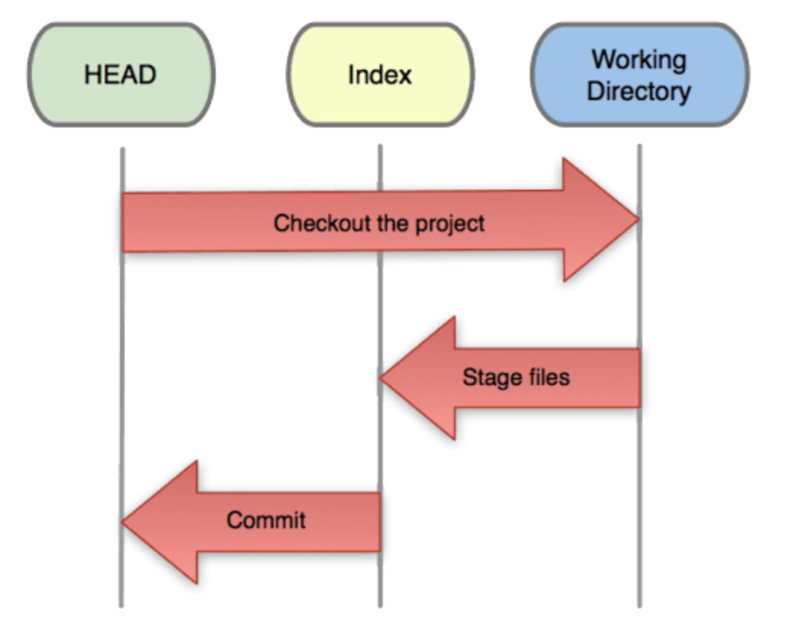

[TOC]
### 1. 在本地创建一个项目

```
$ mkdir hello-world  //创建项目目录hello-world
$ cd hello-world  //进入项目目录
$ git init  //初始化项目
$ touch README
$ git add README  //添加README文件到暂存区
$ git commit -m 'first commit'   //提交更新，并注释信息“first commit”
$ git remote add origin git@github.test/hellotest.git    //与远程github仓库建立连接
$ git push -u origin master   //将本地仓库的更改更新到github仓库上去
```

### 2. git工作流


```
#把所有文件放入暂存区
git add .
#把所有文件从暂存区提交到本地仓库
git commit -m "comment"
#把所有文件从本地仓库推送到相应的远程仓库
git push origin <branch>
```

### 3. 四个区

git之所以令人费解，主要是它相比于svn等等传统的版本管理工具，多引入了一个`暂存区(Stage)`的概念，就因为多了这一个概念，而使很多人疑惑。其实，在初学者来说，每个区具体怎么工作的，我们完全不需要关心，而只要知道有这么4个区就够了：

* 工作区( Working Area )
* 暂存区( Stage )
* 本地仓库( Local Repository )
* 远程仓库( Remote Repository )

### 4. 五种状态

上面提到的4个区，进入每一个区成功之后会产生一个状态，再加上最初始的一个状态，一共是 5 种状态。以下我们把这 5 种状态分别命名为：

* 未修改( Origin )
* 已修改( Modified )
* 已暂存( Staged )
* 已提交( Committed )
* 已推送( Pushed )

### 5. 检查修改

了解了基本概念之后，我们来谈一谈犯错误之后如何撤销的问题。首先，我们要了解如何检查这 3 个步骤当中每一个步骤修改了什么，然后才好判断有没有修改成功。检查修改的二级命令都相同，都是 `git diff`，只是参数有所不同。

#### 5.1 已修改，未暂存

```
git diff
```
首先，对文件进行了修改，但是还没有做 `git add . `之前，我们如何检查有哪些修改：


这里可以看出在原文件中添加了`修改文件`四个字。

#### 5.2 已暂存，未提交(进行了git add操作)

```
git diff --cached
```
现在我们先把修改放入暂存区。执行 `git add .` ，然后执行 `git diff`，发现没有任何结果。这说明 `git diff` 这个命令只检查我们的`工作区和暂存区`之间的差异，如果我们想看到`暂存区和本地仓库`之间的差异，就需要加一个参数`git diff --cached`。

#### 5.3 已提交，未推送

```
git diff master origin/master
```
现在，我们把修改从`暂存区提交到本地仓库` ，再看一下差异。先执行`git commit`，然后再执行`git diff --cached`，没有差异，执行`git diff master origin/master`，可以看到差异。
在这里， `master`就是你的本地仓库 ，而`origin/master` 就是你的远程仓库 ，`master`是主分支，因为我们都在主分支上工作，所以这里两边都是`master` ，而 `origin` 就代表远程。

### 6. 撤销修改
了解清楚如何检查各种修改之后，我们开始尝试各种撤销操作。
#### 6.1 已修改，未暂存
如果我们只是在编辑器里修改了文件，但还没有执行`git add .` ，这时候我们的文件还在工作区 ，并没有进入`暂存区` ，我们可以用：

```
git checkout .
或者
git reset --hard
来进行撤销操作。
```
可以看到，在执行完 git checkout . 之后，修改已被撤销， git diff 没有任何内容了。

`git add .`的反义词是`git checkout .`。做完修改之后，如果你想向前走一步，让修改进入暂存区 ，就执行`git add .`，如果你想向后退一步，撤销刚才的修改，就执行`git checkout .`。

#### 6.2 已暂存，未提交
你已经执行了 `git add .` ，但还没有执行 `git commit -m "comment"` 。这时候你意识到了错误，想要撤销，你可以执行：

```
git reset 或者 git reset HEAD <file>
git checkout .
或者
git reset --hard
```

`git reset` 只是把修改退回到了 `git add .` 之前的状态，也就是说文件本身还处于`已修改未暂存 状态`，你如果想退回`未修改状态`，还需要执行 `git checkout .` 。

或许你已经注意到了，以上两个步骤都可以用同一个命令`git reset --hard`来完成。是的，就是这个强大的命令，可以一步到位地把你的修改完全恢复到`未修改`的状态。

#### 6.3 已提交，未推送
你的手太快，你既执行了 `git add .` ，又执行了 `git commit` ，这时候你的代码已经进入了你的 本地仓库 ，然而你后悔了，怎么办？不要着急，还有办法。

```
git reset --hard origin/master
```
还是这个 `git reset --hard` 命令，只不过这次多了一个参数 `origin/master` ，正如我们上面讲过的， `origin/master` 代表远程仓库 ，既然你已经污染了你的本地仓库 ，那么就从远程仓库把代码取回来吧。

#### 6.4 已推送

很不幸，你的手实在是太快了，你既 `git add` 了，又 `git commit` 了，并且还 `git push`了，这时你的代码已经进入 远程仓库 。如果你想恢复的话，还好，由于你的 本地仓库 和 远程仓库 是等价的，你只需要先恢复 本地仓库 ，再强制 push 到 远程仓库 就好了：

```
git reset --hard HEAD^
git push -f
```
### 7. git reset 命令几个常用参数区别
#### 7.1 HEAD、Index和Working Directory
Git里这三个区域很重要：

1. HEAD：指向最近一次commit里的所有快照；
2. Index：缓存区域，只有Index区域里的东西才可以被commit；
3. Working Directory：工作区(用户操作区域)



当我们checkout分支的时候，git做了以下三件事情：

1. 将HEAD指向当前切换目标分支的最后一次commit；
2. 将HEAD指向的commit里所有文件的快照替换掉Index区域里原来的内容；
3. 将Index区域里的内容填充到Working Directory里。

所以我们可以发现，HEAD、Index、Working Directory这个时候内容都是一模一样的。

**注意：一般会误解为，Index中的内容是空的，只有`git add`后才会有东西。实际上不是，Index里一直是有内容的。** Git的所有操作就是对这三个区域的状态（或内容）的操作。

##### Changed
如果你在Working Directory里修改了文件，git会发现Working Directory里的内容和Index区域里的内容不一致了。这个时候执行`git status`的结果是：

```
# Changes not staged for commit:
```
##### Staged
一个文件仅仅changed是不能被commit的，Git要求只能提交Index里的东西。所以需要`git add`。这个命令的意思是：把Changed的文件的内容同步到Index区域里。这样Working Directory和Index区域的内容就一致了,这个过程被称之为stage。这个时候`git status`的结果是：

```
# Changes to be committed:
```
##### Committed
最后，你就可以提交了，执行`git commit`。这样，就把HEAD的状态和Index以及Working Directory形成一致了。


最初我们编写代码的时候，应该对应上图中的 `Working diretory`，这个时候，我的代码还就是我的，跟 git 半毛钱关系都没有。

然后，我把当前编辑的 A 文件 add 到 git 中，这个时候就跟 git 发生了关系，git 接受了我的代码，然后把这个文件存入了自己的暂存区，后面我对这个文件的更改 ，git 都会知晓。这个状态对应图中的 Stage/Index。

我把写好的 A 文件 commit 到 git ，这就有了一次提交历史。对应图中的 History，在 git 中只要 commit 过的文件，都有各种方式可以恢复，基本来说，就是不会丢了。

好的，那么现在，我发现代码写的不好，需要回退到上一次的提交，有一下几个命令可以选择：

##### 1.git reset --hard
这个命令 非常危险 ，是 git 中少有的几个会丢失信息的操作。它会把回退点之前的所有信息都删掉，一个不留，干干净净。
举个例子：现在我把 A 文件修改了两次，到了 C 状态 ，并且已提交。 那么我的分支指针是指向 C , 当前文件编辑的状态也是在 C。

```
   (F)
A-B-C
    ↑
  master
```
输入`git reset --hard`，结果会变成：

```
 (F)
A-B
  ↑
master
```
我们看到C状态彻底没有了。所以，没事不要用这个命令。
##### 2.git reset --soft
同样是这个状态：

```
   (F)
A-B-C
    ↑
  master
```
输入`git reset --soft`，结果是：

```
 (F)
A-B-C
  ↑
master
```
文件状态与分支的指针都指向上一个提交，C 还是在的，只是没显示。
##### 3.git reset --mixed
还是这个场景：

```
   (F)
A-B-C
    ↑
  master
```
输入`git reset --mixed`，结果是：

```
   (F)
A-B-C
  ↑
master
```
分支指针指向上次提交点，但是文件状态还是在当前文件C,我看到的现象就是C文件还在，但是没有 add，是红色的。
可以看出，三个命令中 mixed 是最好的回退处理方式，其实这也是`git reset`的默认参数。
#### 常用的三种操作(带不同参数)
##### 1. filename
```
# 从暂存区移除文件
git reset HEAD filename
```
如果之前有执行`git add filename`操作，上面的命令操作之后，`filename`文件将处于未被`add`的状态。也就是从 index 转变成 working 状态。
##### 2. HEAD
```
git reset --hard HEAD~n
# 直接回退到前第n个版本
```
##### 3. SHA
```
git reset --hard HEAD~n
# 直接回退到SHA对应的cimmit版本
```
##### 4. 常见以下三个命令

* `git reset --hard`：回退版本，代码也回退，忽略所有修改；
* `git reset --soft`：回退版本，代码不变，回退所有的 add 操作；
* `git reset --mixed`(等同于`git reset`)：回退版本，代码不变，保留 add 操作。

### 8. git revert 删除文件如何恢复？
1. 首先输入`git reset HEAD~`，回退到上一个版本；
2. 再输入`git checkout file`将文件从已修改的状态变为未修改状态。

或者再次执行`git revert`


### 参考文档
1. [关于 git reset 命令几个常用参数的理解](https://blog.csdn.net/hbwindy/article/details/51519999)
2. [git的reset和checkout的区别](https://segmentfault.com/a/1190000006185954?utm_source=tuicool&utm_medium=referral)
3. [一个小时学会Git](http://www.cnblogs.com/best/p/7474442.html#_label3_3_2_10)
4. [git版本回退操作](https://www.barretlee.com/blog/2014/04/28/git-roll-back/)
5. [git版本管理策略及相关技巧(A)](https://www.barretlee.com/blog/2014/05/07/cb-git-improve/)