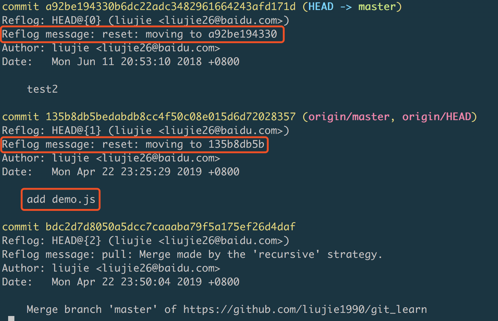

# git数据恢复学习总结

## 目录
  1. [数据恢复](#数据恢复)

## 数据恢复
```js
➜  git_learn git:(master) git log --pretty=oneline
// 输出
135b8db5bedabdb8cc4f50c08e015d6d72028357 (HEAD -> master, origin/master, origin/HEAD) add demo.js
dfc4c86977fb723978063e4f2b0410463ca8f808 git diff test
42075fa0b98e9898a07907cf86cf7de547834afd add & commit
a92be194330b6dc22adc3482961664243afd171d test2
59c78ddf6402908e9be8e54bd889ac2676eea856 test1
d7443e6ed235d7fd7251c03649b496cdf70f6d25 merge test
6a1662e201007cf89b45dcbc79933e714d542fc5 Initial commitv
```
>现在我们reset到下面这个commit：
```js
a92be194330b6dc22adc3482961664243afd171d test2
```
```js
➜  git_learn git:(master) git reset --hard a92be194330
HEAD is now at a92be19 test2
```
```js
➜  git_learn git:(master) git log --pretty=oneline
// 输出
a92be194330b6dc22adc3482961664243afd171d (HEAD -> master) test2
59c78ddf6402908e9be8e54bd889ac2676eea856 test1
d7443e6ed235d7fd7251c03649b496cdf70f6d25 merge test
6a1662e201007cf89b45dcbc79933e714d542fc5 Initial commit
```
```js
➜  git_learn git:(master) git reflog
// 输出
a92be19 (HEAD -> master) HEAD@{0}: reset: moving to a92be194330
135b8db (origin/master, origin/HEAD) HEAD@{1}: reset: moving to 135b8db5b
bdc2d7d HEAD@{2}: pull: Merge made by the 'recursive' strategy.
0315228 HEAD@{3}: reset: moving to 03152280ad8
a92be19 (HEAD -> master)
```
```js
git log -g
```
>`git log -g`会输出`reflog`的正常日志，从而显示更多有用信息：



```js
➜  git_learn git:(master) git reset --hard 135b8db5bedabdb8cc4
HEAD is now at 135b8db add demo.js
```
>再次使用`git log --pretty=oneline`查看，发现数据恢复了：
```js
➜  git_learn git:(master) git log --pretty=oneline
// 输出
135b8db5bedabdb8cc4f50c08e015d6d72028357 (HEAD -> master, origin/master, origin/HEAD) add demo.js
dfc4c86977fb723978063e4f2b0410463ca8f808 git diff test
42075fa0b98e9898a07907cf86cf7de547834afd add & commit
a92be194330b6dc22adc3482961664243afd171d test2
59c78ddf6402908e9be8e54bd889ac2676eea856 test1
d7443e6ed235d7fd7251c03649b496cdf70f6d25 merge test
6a1662e201007cf89b45dcbc79933e714d542fc5 Initial commit
```
**[⬆ 返回顶部](#async学习总结)**

## 参考文档
1. [数据恢复](https://git-scm.com/book/zh/v1/Git-%E5%86%85%E9%83%A8%E5%8E%9F%E7%90%86-%E7%BB%B4%E6%8A%A4%E5%8F%8A%E6%95%B0%E6%8D%AE%E6%81%A2%E5%A4%8D)