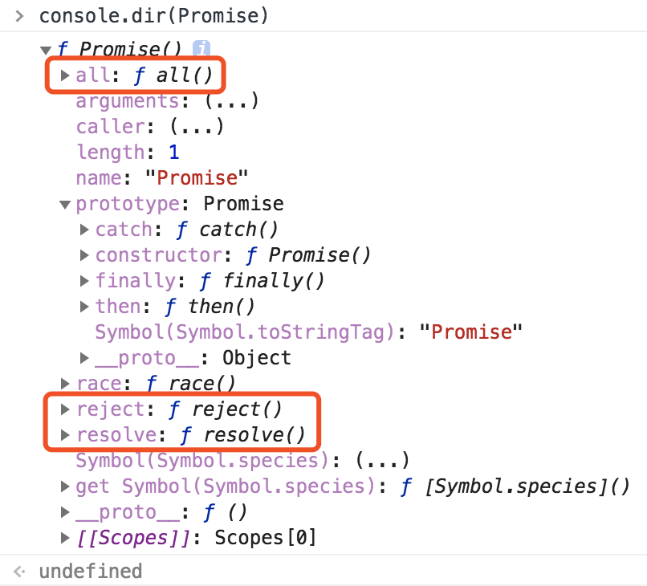
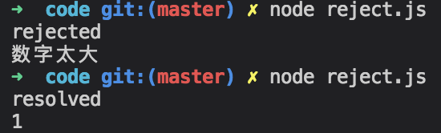
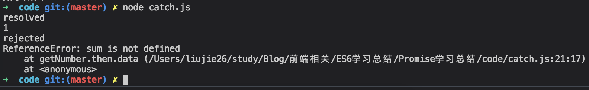

[TOC]

### Promise是什么？

从上图看，Promise是一个构造函数，本身有resolve、reject、all等我们熟悉的方法，原型上有then、catch等方法。这也就是说，通过new Promise()出来的对象上肯定就有then、catch等方法。

### Promise 构造函数
```js
let promise = new Promise(function (resolve, reject) {
  // ...
  if (/* 异步操作成功 */) {
    resolve(value);
  } else { /* 异步操作失败 */
    reject(new Error());
  }
});
```
上面代码中，`Promise`构造函数接受一个函数作为参数，该函数的两个参数分别是`resolve和reject`。它们是两个函数，由`JavaScript`引擎提供，不用自己实现。

* `resolve`函数的作用是：将`Promise`实例的状态从“未完成”变为“成功”（即从`pending变为fulfilled`），在异步操作成功时调用，并将异步操作的结果，作为参数传递出去。
* `reject`函数的作用是：将`Promise`实例的状态从“未完成”变为“失败”（即从`pending变为rejected`），在异步操作失败时调用，并将异步操作报出的错误，作为参数传递出去。

下面来看个示例：
```js
let p = new Promise((resolve, reject) => {
    // 一些异步操作
    setTimeout(() => {
        console.log('执行完了');
        resolve('一些数据');
    }, 2000);
});
```
从上述代码来看：Promise接收一个函数作为参数，并且传入两个参数：resolve和reject，分别表示异步操作执行成功后的回调函数和异步操作执行失败后的回调函数。其实这里用“成功”和“失败”来描述并不准确，按照标准来讲，resolve是将Promise的状态置为fullfiled，reject是将Promise的状态置为rejected。

运行上述代码，会在2秒后输出“执行完了”，实例的状态会变为`fulfilled`。但是，**需要注意：我们只是new了一个Promise对象，并没有调用它，传进去的函数就已经执行了，这是需要注意的一个细节。** 所以我们用Promise的时候一般是放在一个函数中，在需要的时候去运行这个函数，如：
```js
function runAsync() {
    let p = new Promise((resolve, reject) => {
        // 一些异步操作
        setTimeout(() => {
            console.log('执行完了');
            resolve('一些数据');
        }, 2000);
    });
    // return一个Promise对象
    return p;
}

runAsync().then(data => {
    console.log(data);
});
```
在runAsync()的返回值上直接调用then方法，then接收一个参数，是函数，并且会拿到我们在runAsync中调用resolve时传入的的参数。运行这段代码，会在2秒后输出“执行完了”，紧接着输出“一些数据”。

### Promise链式操作
传统多层嵌套的回调函数：
```js
// 传统写法
step1(function (value1) {
  step2(value1, function(value2) {
    step3(value2, function(value3) {
      step4(value3, function(value4) {
        // ...
      });
    });
  });
});

// Promise 的写法
(new Promise(step1))
  .then(step2)
  .then(step3)
  .then(step4);
```
从上面代码可以看到，采用`Promises`以后，程序流程变得非常清楚，十分易读。

总的来说，传统的回调函数写法使得代码混成一团，变得**横向发展**而不是向下发展。`Promise`就是解决这个问题，**使得异步流程可以写成同步流程**。来看个例子：
```js
function runAsync() {
    let p = new Promise((resolve, reject) => {
        // 一些异步操作
        setTimeout(() => {
            console.log('执行完了');
            resolve('一些数据');
        }, 2000);
    });
    // return一个Promise对象
    return p;
}

function runAsync2() {
    let p = new Promise((resolve, reject) => {
        // 一些异步操作
        setTimeout(() => {
            console.log('执行完了2');
            resolve('一些数据2');
        }, 2000);
    });
    // return一个Promise对象
    return p;
}

function runAsync3() {
    let p = new Promise((resolve, reject) => {
        // 一些异步操作
        setTimeout(() => {
            console.log('执行完了3');
            resolve('一些数据3');
        }, 2000);
    });
    // return一个Promise对象
    return p;
}

runAsync().then(data => {
    console.log(data);
    return runAsync2();
}).then(data => {
    console.log(data);
    return runAsync3();
}).then((data) => {
    console.log(data);
});
```
输出结果如下：
```js
执行完了
一些数据
执行完了2
一些数据2
执行完了3
一些数据3
```
在then方法中，我们也可以直接return数据而不是Promise对象，在后面的then中就可以接收到数据了，比如我们把上面的代码修改成这样：
```js
runAsync().then(data => {
    console.log(data);
    return runAsync2();
}).then(data => {
    console.log(data);
    // return runAsync3();
    return '直接返回数据';
}).then((data) => {
    console.log(data);
});
```
```js
执行完了
一些数据
执行完了2
一些数据2
直接返回数据
```
### Promise.prototype.then()
`Promise`实例的`then`方法，用来添加回调函数。

then方法可以接受两个回调函数，第一个是异步操作成功时（变为fulfilled状态）时的回调函数，第二个是异步操作失败（变为rejected）时的回调函数（该参数可以省略），一旦状态改变，就调用相应的回调函数。
```js
var p1 = new Promise((resolve, reject) => {
    resolve('成功');
});
p1.then(console.log, console.error); // 成功

var p2 = new Promise((resolve, reject) => {
    reject(new Error('失败'));
});
p2.then(console.log, console.error); // Error: 失败
```
上面代码中，p1和p2都是`Promise`实例，它们的then方法绑定两个回调函数：成功时的回调函数`console.log`，失败时的回调函数`console.error`（可以省略）。p1的状态变为成功，p2的状态变为失败，对应的回调函数会收到异步操作传回的值，然后在控制台输出。
#### then方法可以链式使用
```js
p1
  .then(step1)
  .then(step2)
  .then(step3)
  .then(
    console.log,
    console.error
  );
```
上面代码中，p1后面有四个then，意味依次有四个回调函数。只要前一步的状态变为`fulfilled`，就会依次执行紧跟在后面的回调函数。

最后一个then方法，回调函数是`console.log和console.error`，用法上有一点重要的区别。`console.log`只显示`step3`的返回值，而`console.error`可以显示`p1、step1、step2、step3`之中任意一个发生的错误。
举例来说，如果`step1`的状态变为`rejected`，那么`step2和step3`都不会执行了（因为它们是resolved的回调函数）。`Promise`开始寻找，接下来第一个为`rejected`的回调函数，在上面代码中是`console.error`。这就是说，**`Promise`对象的报错具有传递性**。

#### then()用法
```js
// 写法一
f1().then(function () {
  return f2();
});

// 写法二
f1().then(function () {
  f2();
});

// 写法三
f1().then(f2());

// 写法四
f1().then(f2);
```
为了便于理解，下面这四种写法都再用`then`方法接一个回调函数`f3`。写法一的`f3`回调函数的参数，是`f2`函数的运行结果。
```js
f1().then(function () {
  return f2();
}).then(f3);
```
>demo:
```js
var p1 = new Promise((resolve, reject) => {
    resolve('成功');
});
const f2 = () => {
    return 'test';
}
const f3 = (value) => {
    console.log(value); // test
};
p1.then(() => {
    return f2();
}).then(f3);
```
>写法二的f3回调函数的参数是undefined
```js
var p1 = new Promise((resolve, reject) => {
    resolve('成功');
});
const f2 = () => {
    return 'test';
}
const f3 = (value) => {
    console.log(value); // undefined
};
p1.then(() => {
    f2();
}).then(f3);
```
>写法三的f3回调函数的参数是`resolve('成功')`
```js
var p1 = new Promise((resolve, reject) => {
    resolve('成功');
});
const f2 = () => {
    return 'test';
}
const f3 = (value) => {
    console.log(value); // 成功
};
p1.then(f2()).then(f3);
```
>写法四与写法一只有一个差别，那就是f2会接收到f1()返回的结果。
```js
var p1 = new Promise((resolve, reject) => {
    resolve('成功');
});
const f2 = (value) => {
    console.log(value); // 成功
    return 'test';
}
const f3 = (value) => {
    console.log(value); // test
};
p1.then(f2).then(f3);
```
### reject的用法
```js
function getNumber() {
    let p = new Promise((resolve, reject) => {
        // 一些异步操作
        setTimeout(() => {
            // 向上取整生成1-10的随机数
            let num = Math.ceil(Math.random() * 10);
            if (num < 5) {
                resolve(num);
            }
            else {
                reject('数字太大');
            }
        }, 1000);
    });
    return p;
};

getNumber().then((data) => {
    console.log('resolved');
    console.log(data);
}, (error) => {
    console.log('rejected');
    console.log(error);
});
```
getNumber函数用来异步获取一个1-10的随机数字，2秒后执行完成，如果数字小于等于5，我们则认为是“成功”了，调用resolve修改Promise的状态。否则我们认为是“失败”了，调用reject并传递一个参数，作为失败的原因。

运行getNumber并且在then中传了两个参数，第一个对应resolve的回调，第二个对应reject的回调。所以我们能够分别拿到他们传过来的数据。多次运行这段代码，会随机得到以下两种结果：


### catch用法
catch用法，其实和then的第二个参数一样，用来指定reject的回调，用法如下：
```js

getNumber().then(data => {
    console.log('resolved');
    console.log(data);
})
.catch(error => {
    console.log('rejected');
    console.log(error);
});
```
效果和写在then的第二个参数里面一样。不过它还有另外一个作用：在执行resolve的回调（也就是上面then中的第一个参数）时，如果抛出异常了（代码出错了），那么并不会报错卡死js，而是会进到这个catch方法中。请看下面的代码：
```js
getNumber().then(data => {
    console.log('resolved');
    console.log(data);
    console.log(sum);
})
.catch(error => {
    console.log('rejected');
    console.log(error);
});
```
在resolve的回调中，我们console.log(sum);而sum这个变量是没有被定义的。如果我们不用Promise，代码运行到这里就直接在控制台报错了，不往下运行了。但是在这里，会得到这样的结果：

也就是说进到catch方法里面去了，而且把错误原因传到了reason参数中。即便是有错误的代码也不会报错了，这与我们的try/catch语句有相同的功能。
### all的用法
Promise的all方法提供了并行执行异步操作的能力，并且在所有异步操作执行完后才执行回调。我们仍旧使用上面定义好的runAsync1、runAsync2、runAsync3这三个函数，看下面的例子：
```js
function runAsync() {
    let p = new Promise((resolve, reject) => {
        // 一些异步操作
        setTimeout(() => {
            console.log('执行完了');
            resolve('一些数据');
        }, 2000);
    });
    // return一个Promise对象
    return p;
}

function runAsync2() {
    let p = new Promise((resolve, reject) => {
        // 一些异步操作
        setTimeout(() => {
            console.log('执行完了2');
            resolve('一些数据2');
        }, 2000);
    });
    // return一个Promise对象
    return p;
}

function runAsync3() {
    let p = new Promise((resolve, reject) => {
        // 一些异步操作
        setTimeout(() => {
            console.log('执行完了3');
            resolve('一些数据3');
        }, 2000);
    });
    // return一个Promise对象
    return p;
}

Promise.all([runAsync(), runAsync2(), runAsync3()])
.then(result => {
    console.log(result);
});
```
用Promise.all来执行，all接收一个数组参数，里面的值最终都算返回Promise对象。这样，三个异步操作的并行执行的，等到它们都执行完后才会进到then里面。那么，三个异步操作返回的数据哪里去了呢？都在then里面呢，all会把所有异步操作的结果放进一个数组中传给then，就是上面的result。
```js
执行完了
执行完了2
执行完了3
[ '一些数据', '一些数据2', '一些数据3' ]
```
### race的用法
all方法的效果实际上是「谁跑的慢，以谁为准执行回调」，那么相对的就有另一个方法「谁跑的快，以谁为准执行回调」，这就是race方法，这个词本来就是赛跑的意思。race的用法与all一样，我们把上面runAsync的延时改为1秒来看一下：
```js
function runAsync() {
    let p = new Promise((resolve, reject) => {
        // 一些异步操作
        setTimeout(() => {
            console.log('执行完了');
            resolve('一些数据');
        }, 1000);
    });
    // return一个Promise对象
    return p;
}

function runAsync2() {
    let p = new Promise((resolve, reject) => {
        // 一些异步操作
        setTimeout(() => {
            console.log('执行完了2');
            resolve('一些数据2');
        }, 2000);
    });
    // return一个Promise对象
    return p;
}

function runAsync3() {
    let p = new Promise((resolve, reject) => {
        // 一些异步操作
        setTimeout(() => {
            console.log('执行完了3');
            resolve('一些数据3');
        }, 2000);
    });
    // return一个Promise对象
    return p;
}

Promise.race([runAsync(), runAsync2(), runAsync3()])
.then(result => {
    console.log(result);
});
```
```js
执行完了
一些数据
执行完了2
执行完了3
```
在then里面的回调开始执行时，runAsync2()和runAsync3()并没有停止，仍旧再执行。于是再过1秒后，输出了他们结束的标志。

这个race有什么用呢？使用场景还是很多的，比如我们可以用race给某个异步请求设置超时时间，并且在超时后执行相应的操作，代码如下：
```js
// 请求某个图片资源
function requestImg() {
    var p = new Promise(function(resolve, reject) {
        var img = new Image();
        img.onload = function() {
            resolve(img);
        }
        img.src = 'xxxxxx';
    });
    return p;
}

// 延时函数，用于给请求计时
function timeout() {
    var p = new Promise(function(resolve, reject) {
        setTimeout(function(){
            reject('图片请求超时');
        }, 5000);
    });
    return p;
}

Promise
.race([requestImg(), timeout()])
.then(function(results){
    console.log(results);
})
.catch(function(reason){
    console.log(reason);
});
```
### Promise 的实例
#### 加载图片
我们可以把图片的加载写成一个Promise对象。
```js
var preloadImage = function (path) {
  return new Promise(function (resolve, reject) {
    var image = new Image();
    image.onload  = resolve;
    image.onerror = reject;
    image.src = path;
  });
};
```
### Ajax 操作
Ajax 操作是典型的异步操作，传统上往往写成下面这样。
```js
function search(term, onload, onerror) {
  var xhr, results, url;
  url = 'http://example.com/search?q=' + term;

  xhr = new XMLHttpRequest();
  xhr.open('GET', url, true);

  xhr.onload = function (e) {
    if (this.status === 200) {
      results = JSON.parse(this.responseText);
      onload(results);
    }
  };
  xhr.onerror = function (e) {
    onerror(e);
  };

  xhr.send();
}

search('Hello World', console.log, console.error);
```
如果使用 Promise 对象，就可以写成下面这样。
```js
function search(term) {
  var url = 'http://example.com/search?q=' + term;
  var xhr = new XMLHttpRequest();
  var result;

  var p = new Promise(function (resolve, reject) {
    xhr.open('GET', url, true);
    xhr.onload = function (e) {
      if (this.status === 200) {
        result = JSON.parse(this.responseText);
        resolve(result);
      }
    };
    xhr.onerror = function (e) {
      reject(e);
    };
    xhr.send();
  });

  return p;
}

search('Hello World').then(console.log, console.error);
```
加载图片的例子，也可以用 Ajax 操作完成。
```js
function imgLoad(url) {
  return new Promise(function (resolve, reject) {
    var request = new XMLHttpRequest();
    request.open('GET', url);
    request.responseType = 'blob';
    request.onload = function () {
      if (request.status === 200) {
        resolve(request.response);
      } else {
        reject(new Error('图片加载失败：' + request.statusText));
      }
    };
    request.onerror = function () {
      reject(new Error('发生网络错误'));
    };
    request.send();
  });
}
```
`Promise`的优点在于：让回调函数变成了规范的**链式写法**，程序流程可以看得很清楚。它有一整套接口，可以实现许多强大的功能，比如同时执行多个异步操作，等到它们的状态都改变以后，再执行一个回调函数；再比如，为多个回调函数中抛出的错误，统一指定处理方法等等。

而且，`Promise`还有一个传统写法没有的好处：**它的状态一旦改变，无论何时查询，都能得到这个状态**。这意味着，无论何时为`Promise`实例添加回调函数，该函数都能正确执行。所以，你不用担心是否错过了某个事件或信号。如果是传统写法，通过监听事件来执行回调函数，一旦错过了事件，再添加回调函数是不会执行的。

`Promise`的缺点是：编写的难度比传统写法高，而且阅读代码也不是一眼可以看懂。你只会看到一堆then，必须自己在then的回调函数里面理清逻辑。

### 微任务
`Promise`的回调函数属于异步任务，会在同步任务之后执行。
```js
new Promise(function (resolve, reject) {
  resolve(1);
}).then(console.log);

console.log(2);
// 2
// 1
```
上面代码会先输出2，再输出1。因为`console.log(2)`是同步任务，而then的回调函数属于异步任务，一定晚于同步任务执行。

但是，`Promise`的回调函数不是正常的异步任务，而是**微任务**（`microtask`）。它们的区别在于：正常任务追加到下一轮事件循环，**微任务追加到本轮事件循环**。这意味着，微任务的执行时间一定早于正常任务。
```js
// 下次事件循环
setTimeout(function() {
  console.log(1);
}, 0);

new Promise(function (resolve, reject) {
  resolve(2);
}).then(console.log);

console.log(3);
// 3
// 2
// 1
```
上面代码的输出结果是`3 2 1`。这说明`then`的回调函数的执行时间，早于`setTimeout(fn, 0)`。因为`then`是本轮事件循环执行，`setTimeout(fn, 0)`在下一轮事件循环开始时执行。

#### 参考文档

1. [Promise 对象](https://javascript.ruanyifeng.com/advanced/promise.html#toc5)
1. [大白话讲解Promise（一）](http://www.cnblogs.com/lvdabao/p/es6-promise-1.html)
