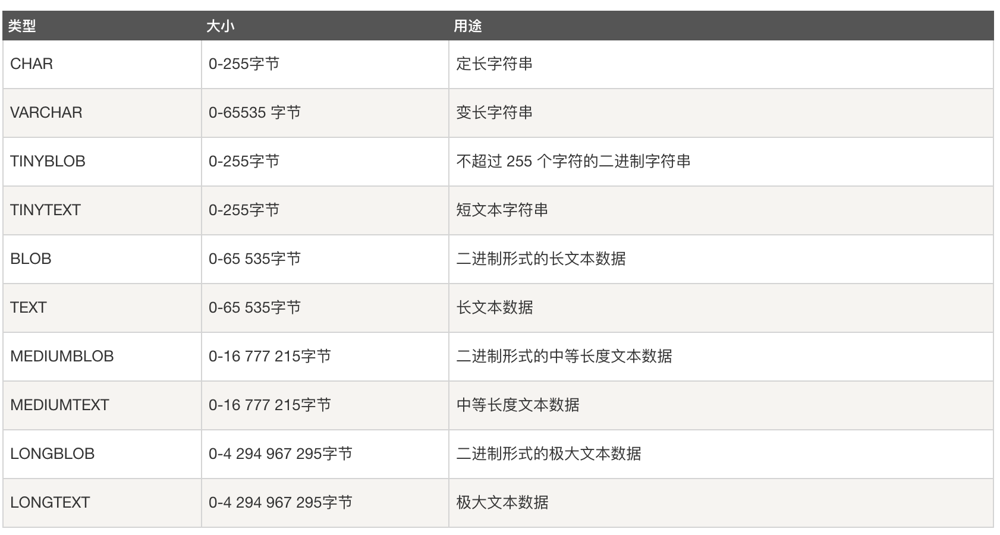

MySQL中定义数据字段的类型对你数据库的优化是非常重要的。

**MySQL支持多种类型，大致可以分为三类：**

1. 数值
2. 日期/时间
3. 字符串(字符)类型。

### 数据类型
数据类型是指列、存储过程参数、表达式和局部变量的数据特征，它决定了数据的存储格式，代表了不同的信息类型。
#### 数值

#### 时间日期

#### 字符串


1. CHAR 和 VARCHAR 类型类似，但它们保存和检索的方式不同。它们的最大长度和是否尾部空格被保留等方面也不同。在存储或检索过程中不进行大小写转换。
2. BINARY 和 VARBINARY 类似于 CHAR 和 VARCHAR，不同的是它们包含二进制字符串而不要非二进制字符串。也就是说，它们包含字节字符串而不是字符字符串。这说明它们没有字符集，并且排序和比较基于列值字节的数值值。
3. BLOB 是一个二进制大对象，可以容纳可变数量的数据。有 4 种 BLOB 类型：TINYBLOB、BLOB、MEDIUMBLOB 和 LONGBLOB。它们区别在于可容纳存储范围不同。
4. 有 4 种 TEXT 类型：TINYTEXT、TEXT、MEDIUMTEXT 和 LONGTEXT。对应的这 4 种 BLOB 类型，可存储的最大长度不同，可根据实际情况选择。

### 1. 数据表操作
数据表(或者称表)是数据库最重要的组成部分之一，是其他对象的基础。

* 创建数据表
* 记录插入
* 查找记录
* PRIMARY KEY(主键约束)
* UNIQUE KEY(唯一约束)
* DEFAULT(默认约束)
* NOT NULL(非空约束)

#### 1.1 创建数据表

```js
CREATE TABLE IF NOT EXISTS runoob_tbl(
   runoob_id INT UNSIGNED PRIMARY KEY AUTO_INCREMENT,
   runoob_title VARCHAR(100) NOT NULL,
   runoob_author VARCHAR(40) NOT NULL,
   submission_date DATE
)ENGINE=InnoDB DEFAULT CHARSET=utf8;
```
1. 如果你不想字段为 NULL 可以设置字段的属性为 NOT NULL，在操作数据库时如果输入该字段的数据为NULL ，就会报错。
2. AUTO_INCREMENT定义列为自增的属性，一般用于主键，数值会自动加1。
3. PRIMARY KEY关键字用于定义列为主键。 您可以使用多列来定义主键，列间以逗号分隔。
4. ENGINE 设置存储引擎，CHARSET 设置编码。
5. UNSIGNED表示无符号，非负值

> 特别注意：MySQL命令终止符默认为分号 (;)

#### 查看数据库中的数据表
```
// 查看当前数据库的数据表
SHOW TABLES;

// 查看其他数据库的数据表(db_name)
SHOW TABLES [FROM db_name] [LIKE 'pattern' | WHERE expr]
```

#### desc查看数据表结构的详细信息

* 查看创建数据表的语句

```js
show create table table_name;
```
* 查看数据表结构

```js
desc table_name; 或者
show columns from table_name;
```
```js
desc books;
+---------+-------------+------+-----+---------+----------------+
| Field   | Type        | Null | Key | Default | Extra          |
+---------+-------------+------+-----+---------+----------------+
| id      | int(10)     | NO   | PRI | NULL    | auto_increment |
| genreid | int(10)     | NO   |     | NULL    |                |
| name    | varchar(50) | NO   |     | NULL    |                |
+---------+-------------+------+-----+---------+----------------+
```
* Field: 表示的是列名
* Type: 表示的是列的数据类型
* Null: 表示这个列是否能取空值
* Key: 在mysql中key 和index 是一样的意思，这个Key列可能会看到有如下的值：PRI(主键)、MUL(普通的b-tree索引)、UNI(唯一索引)
* Default: 列的默认值
* Extra: 其它信息

#### 插入记录
```
// 可以给所有字段赋值，也可以给部分字段赋值
INSERT [INTO] table_name [(col_name, ...)] VALUES (val, ...)
```

#### 记录查找
```
select expr, ... from table_name
```

#### 空值与非空
* NULL：在进行记录插入时字段值可以为空
* NOT NULL：在进行记录插入时字段值禁止为空

#### 自动编号(AUTO_INCREMENT)
* 自动编号，且必须与主键组合使用；
* 默认情况下，起始值为1，每次的增量为1。

**特别注意：自动编号的字段必须设置成主键。还有就是自动编号必须与主键组合使用，但是主键不一定要设置成自动编号。主键可以被赋值，但是不能被赋予相同的值。**

#### PRIMARY KEY
* 主键约束
* 每张数据表只能存在一个主键
* 主键保证记录的唯一性
* 主键自动为NOT NULL(即主键字段不能为空)

#### UNIQUE KEY
* 唯一约束
* 唯一约束可以保证记录的唯一性
* 唯一约束的字段可以为空值(NULL)
* 每张数据表可以存在多个唯一约束

**特别注意：一张数据表中只能存在一个主键约束，但是可以存在多个唯一约束，这是主键约束和唯一约束的区别。**

#### DEFAULT(默认值)
当插入记录时，如果没有明确为字段赋值，则自动赋予默认值。

#### 命令行显示当前数据库记录
```
select * from books\G
```
#### 删除数据表
```
# 删除表内数据
delete from 表名 where 删除条件;

# 清除表内数据，保存表结构，用truncate
truncate table 表名;

# 删除表用 drop，就是啥都没了
drop  table  表名;
```
#### 查询语句中limit offset用法
```js
2表示返回2行，1表示从表的第2行开始
方法1：select * from students limit 2 offset 1;
方法2：select * from students limit 1,2;

+----+--------+---------------------+
| id | name   | time                |
+----+--------+---------------------+
|  2 | 小红   | 2018-05-17 12:04:26 |
|  3 | 小花   | 2018-05-17 12:09:34 |
+----+--------+---------------------+
```
#### 通过limit和offset或只通过limit可以实现分页功能
假设`numberperpage`表示每页要显示的条数，`pagenumber`表示页码，那么返回第`pagenumber`页，每页条数为`numberperpage的sql`语句：

```
方法1：
select * from studnet limit (pagenumber-1)*numberperpage,numberperpage

方法2：
select * from student limit numberperpage offset (pagenumber-1)*numberperpage
```
#### like子句匹配/模糊匹配(通常与 % 和 _ 结合使用)

* `%a`：以a结尾的数据
* `a%`：以a开头的数据
* `%a%`：含有a的数据
* `_a_`：三位且中间字母是a的
* `_a`：两位且结尾字母是a的
* `a_`：两位且开头字母是a的

```js
// 查询以 java 字段开头的信息
SELECT * FROM position WHERE name LIKE 'java%';

// 查询包含 java 字段的信息
SELECT * FROM position WHERE name LIKE '%java%';

// 查询以 java 字段结尾的信息。
SELECT * FROM position WHERE name LIKE '%java';
```
#### UNION 操作符
UNION 操作符用于连接两个以上的 SELECT 语句的结果组合到一个结果集合中。多个 SELECT 语句会删除重复的数据。
```js
select country from Websites UNION select country from app order by country;
+---------+
| country |
+---------+
| CN      |
| IND     |
| USA     |
+---------+
```

#### 1.1 约束

1. 约束保证数据的完整性和一致性；
2. 约束分为表级约束(针对多个字段使用)和列级别约束(只针对某一个字段使用)；
需要注意：
1.表级约束与列级约束
    - 1）对一个数据列建立的约束，称为列级约束；
    - 2）对多个数据列建立的约束，称为表级约束；
    - 3）列级约束既可以在列定义时声明，也可以在列定以后声明；
    - 4）表级约束只能在列定义后声明；

2.主键、外键、非空、唯一、default都是约束条件。主键、外键、唯一既可以作为表级约束，也可作为列级约束,（ not null， default ）只有列级约束。

3. 约束类型包括：
    - NOT NULL(非空约束)
    - PRIMARY KEY(主键约束)
    - UNIQUE KEY(唯一约束)
    - DEFAULT(默认约束)
    - FOREIGN KEY(外键约束)

>外键约束作用：

    1. 保证数据一致性和完整性；
    2. 实现一对一或一对多关系。

1. 外键存在的目的
    - 保持数据一致性、完整性
    - 实现一对一或一对多的关系
2. 父表与子表
    - 子表：具有外键列的表
    - 父表：子表参照的表
3. 外键约束的要求
    - 父表和子表必须使用相同的存储引擎，而且禁止使用临时表。
    - 数据表的存储引擎只能为InnoDB。
    - 外键列和参照列必须具有相似的数据类型。其中数字的长度或是否有符号位（正数或负数）必须相同；而字符的长度则可以不同。
    - 外键列和参照列必须创建索引。如果外键列不存在索引的话，MySQL将自动创建索引。
    - 如果参照列不存在索引的话，MySQL不会自动创建索引。但如果参照列为主键的话，则会自动创建索引。
    - 主键在创建的同时会自动创建索引，所以参照列其实已经有了索引。而外键列上没有创建索引，Mysql则会自动创建索引。

#### 1.2 编辑数据表的默认存储引擎

在MySQL的配置文件(my.ini)中设置：
default-storage-engine = INNODB
然后重启MySQL数据库。

#### 1.3 显示数据表的索引

```
SHOW INDEXS FROM tables;或者
SHOW INDEXS FROM tables\G;
```
#### 1.4 外键约束的参照操作
CASCADE: 删除或更新父表中的数据相应的删除或更新子表中的相匹配的行;
SET NULL: 从父表删除或更新行，会设置子表中的外键列为NULL，如果使用该选项，必须保证子表列没有指定NOT NULL;
RESTRICT: 拒绝对父表的删除或更新操作;
NO ACTION: 标准的SQL语句，在MYSQL当中与RESTRICT相同。


#### 1.5 空值与非空值
空值 NULL
非空值 NOT NULL

1. AUTO_INCREMENT：自动编号，且必须与主键组合使用，默认情况下，起始值为1，每次的增量为1。
2. PRIMARY KEY：主键。
主键约束：
每张数据表只能存在一个主键；
主键保证记录的唯一性；
主键自动为NOT NULL。
3. UNIQUE KEY:
唯一约束；
唯一约束可以保证记录的唯一性；
唯一约束的字段可以为空值(NULL)；
每张数据表可以存在多个唯一约束。
1. DEFAULT(默认值)
当插入记录时，如果没有明确为字段赋值，则自动赋予默认值。

#### 1.6 修改数据表

```js
// 添加单个字段
// FIRST表示将字段添加到第一位
// AFTER表示在某个字段后面添加相应字段
ALTER TABLE tableName ADD [COLUMN] columnName VARCHAR(20) NOT NULL [FIRST|AFTER columnName];

// 添加多个字段
ALTER TABLE tableName ADD [COLUMN] (columnName1, columnName2);

// 删除单个字段
ALTER TABLE tableName DROP [COLUMN]columnName;

// 删除多个字段，用逗号分隔
ALTER TABLE tableName DROP [COLUMN]columnName1, DROP columnName2;

// 删除一个字段并添加一个新字段
ALTER TABLE tableName DROP [COLUMN]columnName, ADD columnName;
```

添加主键约束：

```js
ALTER TABLE tbl_name ADD [CONSTRAINT[symbol]] PRIMARY KEY
[index_type](index_col_name,...)
CONSTRAINT[symbol]:给约束添加名称；
[index_type]:约束类型，包括哈希索引和BTree索引（默认）
// 例如：ALTER TABLE users2 ADD CONSTRAINT PK_users2_id PRIMARY KEY (id);
```

添加唯一约束：

```js
ALTER TABLE tbl_name ADD [CONSTRAINT[smybol]] UNIQUE [INDEX|KEY]
[index_name] [index_type] (index_col_name,...)
例如：ALTER TABLE users2 ADD UNIQUE (username);
```

添加外键约束：

```js
ALTER TABLE tbl_name ADD [CONSTRAINT[smybol]] FOREIGN KEY
[index_name] (index_col_name,...) reference_definition
例如：ALTER TABLE users2 ADD FOREIGN KEY(pid) REFERENCES provinces (id);
```
添加/删除默认约束：

```js
ALTER TABLE tbl_name ALTER [COLUMN] col_name{SET DEFAULT literal|DROP DEFAULT}
例如添加：ALTER TABLE users2 ALTER age SET DEFAULT 15;
例如删除：ALTER TABLE users2 ALTER age DROP DEFAULT;
```

数据表的修改操作：无非就是添加列，删除列，添加约束，删除约束。用的是ALTER，而
INSERT是对数据表添加插入记录用的。

#### 1.7 删除约束
约束的 index_name 可通过 SHOW INDEX FROM table_name\G; 查询

```
// 删除主键约束：
ALTER TABLE table_name DROP PRIMARY KEY;

// 删除唯一约束：
ALTER TABLE table_name DROP INDEX index_name;

// 删除外键约束：
ALTER TABLE table_name DROP FOREIGN KEY （fk_symbol）通过查询系统默认给的名字;
外键约束的名字 fk_symbol 可通过 SHOW CREATE TABLE table_name; 查询
删除外键约束，查找CREATE TABLENAME 找到系统为外键约束添加的名字
```
#### 1.8 修改列定义

```
ALTER TABLE tableName MODIFY columnName SMALLINT UNSIGNED NOT NULL FIRST;
ALTER TABLE tableName CHANGE oldColumnName newColumnName INT NOT NULL AFTER username;
```
#### 1.9 修改表名

```
ALTER TABLE tableName RENAME newTableName;
RENAME TABLE oldTableName TO newTableName;
```

#### 2.0 修改列定义

```
ALTER TABLE tbl_name MODIFY [COLUMN] col_name column_definition [FIRST |AFTER col_name];
ALTER TABLE users2 MODIFY id SMALLINT UNSIGNED NOT NULL FIRST; //将id字段的位置提到第一列
SHOW COLUMNS FROM users2;
ALTER TABLE users2 MODIFY id TINYINT UNSIGNED NOT NULL; //修改数据类型,需注意数据丢失的问题
```
2.修改列名称

```
ALTER TABLE tbl_name CHANGE [COLUMN] col_name new_col_name column_definition [FIRST|AFTER col_name];
ALTER TABLE users2 CHANGE pid p_id TINYINT UNSIGNED; //修改列名称
```
3.数据表更名

```
#方法1
ALTER TABLE tbl_name RENAME [TO/AS] new_tbl_name
ALTER TABLE users2 RENAME (to/as) users3;
SHOW TABLES;
#方法2
RENAME TABLE tbl_name TO new_tbl_name [, tbl_name2 TO new_tbl_name2] ...
RENAME TABLE users5 TO users2;
尽量少使用数据表的列名及表名的更名。
```
### COLLATE utf8_general_ci的含义
在我们创建数据库的时候，经常用到的创建语句是：

```
CREATE DATABASE 'LUCAS' DEFAULT CHARACTER SET utf8 COLLATE utf8_general_ci;
```
虽然一直这样写，但是总是对最后的`COLLATE utf8_general_ci`不太明白，现梳理如下：


`CREATE DATABASE 'LUCAS'`:创建一个名为“LUCAS”的数据库；

`DEFAULT CHARACTER SET utf8`：设置数据库的字符集编码默认为utf8，是utf8而不是utf-8;

`COLLATE utf8_general_ci`：数据库的校验规则，ci是case insensitive的缩写，意思是大小写不敏感；相对的是cs，即case sensitive，大小写敏感；还有一种是utf8_bin，是将字符串中的每一个字符用二进制数据存储，区分大小写。

整理如下：

* utf8_bin：区分大小写；
* utf8_general_cs：大小写敏感；
* utf8_general_ci：大小写不敏感。


### 相关资料
1. [21分钟 MySQL 入门教程](https://www.cnblogs.com/mr-wid/archive/2013/05/09/3068229.html#c1)
2. [mysql中的unsigned数据型使用说明](https://yq.aliyun.com/ziliao/65142)