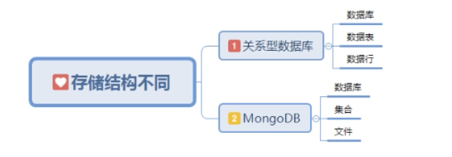

# MongoDB基础操作
## 目录
   - [mongo shell](#mongo命令行)
     - [基本Shell命令](#基本Shell命令)
     - [MongoDB存储结构](#MongoDB存储结构)
   - [数据基本操作](#数据基本操作)
     - [插入数据](#插入数据)
     - [查询数据](#查询数据)
     - [更新数据](#更新数据)
     - [删除数据](#删除数据)
   - [使用js文件写mongo命令](#使用js文件写mongo命令)
   - [批量插入数据](#批量插入数据)
     - [循环插入](#循环插入)
     - [批量插入](#批量插入)
   - [update常见错误](#update常见错误)
   - [update修改器](#update修改器)
   - [创建索引](#创建索引)

## mongo命令行
>mongo Shell：每个数据库都有自己独特的命令，MSSQL和mySql用的都是Sql命令，MongoDB的操作命令就是前端最熟悉的JS命令。下面来看几个例子：

```js
// 定义一个变量
> var a = 'hello'
> print(a)
hello
```
需要注意：这里打印需要使用`print`，而不是`console`。
```js
// 定义一个函数
> function test(){
... return '123';
... }
> print(test())
123
```
### 基本Shell命令

- show dbs：显示已有数据库，刚安装好的情况下，默认会有local、admin(config)，这是MongoDB的默认数据库，我们在新建库时是不允许起这些名称的，需要注意的是：该命令不显示数据为空的数据库；
- use admin：进入admin数据，也可以理解为使用数据库。成功会显示：switched to db admin；
- show collections：显示数据库中的集合；
- db：显示当前我们使用的数据库名称，这个命令最常用，因为我们在做任何操作之前都应该先查看一下当前所在的数据库，以免造成操作错误。

### MongoDB存储结构

由上图可以看出：关系型数据库的数据结构最顶层是数据库，数据库库下面是数据表，数据表下面是数据。但是MongoDB有所不同，数据库下面是集合，集合下面是文件。其实为了方便记忆，我们可以简单理解数据表就是集合，数据行就是文件。

**[⬆ 返回顶部](#MongoDB基础操作)**

## 数据基本操作
- use db：进入对应的数据库，需要注意：use不仅可以进入一个数据库，如果对应的数据库不存在，会自动创建响应的数据库，但是在没有集合前，该数据库默认为空；
- db.集合.insert()：新建集合和插入数据，当集合不存在时，会自动新建一个集合，并向里边插入对应数据；
- db.集合.find()：查询集合里的所有文件数据，这条命令会列出集合下的所有数据，可以看到MongoDB是自动给我们加入了索引值的；
- db.集合.findOne()：查询集合中的第一个文件数据，需要注意：MongoDB中的所有组合单词都使用首字母小写的驼峰式写法；
- db.集合.update({查询},{修改})：修改文件数据，第一个是查询条件，第二个是要修改成的值。需要注意的是：可以新增文件数据项的；
- db.集合.remove(条件)：删除文件数据，注意的是要跟一个条件；
- db.集合.drop()：删除整个集合，这个在实际工作中一定要谨慎使用，如果是程序，一定要二次确认；
- db.dropDatabase()：删除整个数据库，在删除库时，一定要先进入数据库，然后再删除。实际工作中这个基本不用，实际工作肯定需要保留数据和痕迹的。

```js
// 进入user数据库
> use user
switched to db user

// 查看数据库中所有集合
> show collections
books
people
users

// 向classRoom集合中插入两条数据
> db.classRoom.insert({"name": "lisi"})
WriteResult({ "nInserted" : 1 })
> db.classRoom.insert({"name": "wangwu"})
WriteResult({ "nInserted" : 1 })

// 重新查看数据库中的所有集合
> show collections
books
classRoom
people
users

// 查询所有数据
> db.classRoom.find()
{ "_id" : ObjectId("5cba9a0b057780bbe7ea1514"), "name" : "lisi" }
{ "_id" : ObjectId("5cba9a13057780bbe7ea1515"), "name" : "wangwu" }

// 查询第一个文件数据
> db.classRoom.findOne()
{ "_id" : ObjectId("5cba9a0b057780bbe7ea1514"), "name" : "lisi" }

// 给name为lisi的数据项增加age
> db.classRoom.update({"name": "lisi"}, {"name": "lisi", age: 18})
WriteResult({ "nMatched" : 1, "nUpserted" : 0, "nModified" : 1 })

// 重新查询
> db.classRoom.find()
{ "_id" : ObjectId("5cba9a0b057780bbe7ea1514"), "name" : "lisi", "age" : 18 }
{ "_id" : ObjectId("5cba9a13057780bbe7ea1515"), "name" : "wangwu" }

// 删除数据
> db.classRoom.remove({"name": "wangwu"})
WriteResult({ "nRemoved" : 1 })
// 重新查询
> db.classRoom.find()
{ "_id" : ObjectId("5cba9a0b057780bbe7ea1514"), "name" : "lisi", "age" : 18 }

// 删除整个集合
> db.classRoom.drop()
true
// 重新查看数据库所有集合
> show collections
books
people
users

// 新建user2数据库
> use user2
switched to db user2
// 删除user2数据库
> db.dropDatabase()
{ "dropped" : "user2", "ok" : 1 }
```
**[⬆ 返回顶部](#MongoDB基础操作)**
### 插入数据
```js
// 切换数据库(数据库不存在也没关系)
// 如果test数据库不存在则创建，存在则切换到test数据库
> use test
switched to db test
```
```js
// 向test_collection集合中插入数据
> db.test_collection.insert({name: '鲁班七号'})
WriteResult({ "nInserted" : 1 })
```
**[⬆ 返回顶部](#MongoDB基础操作)**
### 查询数据
```js
// 查看存在的数据库
> show dbs
admin    0.000GB
config   0.000GB
local    0.000GB
myDbs    0.000GB
myheros  0.000GB
test     0.000GB
```
```js
// find有6个参数
> db.books.find(query, fields, limit, skip, batchSize, options)
```
```js
// 查看数据库版本
> db.version()
3.6.3
```
```js
// 使用find查找数据
// find方法参数为空则返回全部数据
> db.test_collection.find()
{ "_id" : ObjectId("5b8a56d52c0516ea271c4f82"), "name" : "鲁班七号" }
{ "_id" : ObjectId("5b8a96fc2c0516ea271c4f83"), "name" : "后羿" }
// 返回指定name的数据
> db.test_collection.find({name: '后羿'})
{ "_id" : ObjectId("5b8a96fc2c0516ea271c4f83"), "name" : "后羿" }
```
```js
// for循环插入多条数据
> for(i=2;i<100;i++)db.test_collection.insert({x:i})
WriteResult({ "nInserted" : 1 })
```
```js
// 查看集合中数据条数
> db.test_collection.find().count()
100
```
```js
// skip(n) 跳过n条数据
// limit(m) 限制返回m条数据
// sort({x:1}) 根据x字段排序，1表示升序，-1表示降序
> db.test_collection.find().skip(3).limit(4).sort({x:1})
{ "_id" : ObjectId("5b8a982c2c0516ea271c4f85"), "x" : 3 }
{ "_id" : ObjectId("5b8a982c2c0516ea271c4f86"), "x" : 4 }
{ "_id" : ObjectId("5b8a982c2c0516ea271c4f87"), "x" : 5 }
{ "_id" : ObjectId("5b8a982c2c0516ea271c4f88"), "x" : 6 }

> db.test.find().skip(3).limit(5).sort({x:-1})
{ "_id" : ObjectId("5cbaa480057780bbe7ea1577"), "x" : 97 }
{ "_id" : ObjectId("5cbaa480057780bbe7ea1576"), "x" : 96 }
{ "_id" : ObjectId("5cbaa480057780bbe7ea1575"), "x" : 95 }
{ "_id" : ObjectId("5cbaa480057780bbe7ea1574"), "x" : 94 }
{ "_id" : ObjectId("5cbaa480057780bbe7ea1573"), "x" : 93 }
```

**[⬆ 返回顶部](#MongoDB基础操作)**
### 更新数据
```js
// 查询x:3数据
> db.test_collection.find({x:3})
{ "_id" : ObjectId("5b8a982c2c0516ea271c4f85"), "x" : 3 }
// 更新x:3数据为x:333
> db.test_collection.update({x:3}, {x:333})
WriteResult({ "nMatched" : 1, "nUpserted" : 0, "nModified" : 1 })
```
```js
> db.test_collection.insert({x:100, y:100, z:100})
WriteResult({ "nInserted" : 1 })
// 部分数据更新采用$set
> db.test_collection.update({z:100},{$set:{y:99}})
WriteResult({ "nMatched" : 1, "nUpserted" : 0, "nModified" : 1 })
// 查询更新后的结果
> db.test_collection.find({z:100})
{ "_id" : ObjectId("5b8a9be92c0516ea271c4fe6"), "x" : 100, "y" : 99, "z" : 100 }
```
```js
// 第三个参数true，表示当y=100的数据不存在时，自动插入y=999的数据(即要更新的数据)
> db.test_collection.update({y:100},{y:999},true)
WriteResult({
	"nMatched" : 0,
	"nUpserted" : 1,
	"nModified" : 0,
	"_id" : ObjectId("5b8b4e4cc06181d9a6bb896b")
})
> db.test_collection.find({y:999})
{ "_id" : ObjectId("5b8b4e4cc06181d9a6bb896b"), "y" : 999 }
```
```js
db.collection.update(<query>, <update>, {upsert: <boolean>,multi: <boolean>,writeConcern: <document> } )
```
>参数说明：

* query：update的查询条件；
* update：update的对象和一些更新的操作符（如$,$inc...）等；
* upsert：可选，这个参数的意思是，如果不存在update的记录，是否插入objNew,true为插入，默认是false；
* multi：可选，mongodb 默认是false，只更新找到的第一条记录；
* writeConcern：可选，抛出异常的级别。

**[⬆ 返回顶部](#MongoDB基础操作)**
## 删除数据
```js
// 删除数据使用remove()方法，该方法必须传入参数，否则报错
> db.test_collection.remove()
2018-09-02T10:51:51.996+0800 E QUERY    [thread1] Error: remove needs a query :
DBCollection.prototype._parseRemove@src/mongo/shell/collection.js:357:1
DBCollection.prototype.remove@src/mongo/shell/collection.js:382:18
@(shell):1:1
// 删除y=999的数据
> db.test_collection.remove({y:999})
WriteResult({ "nRemoved" : 1 })
// 删除数据表
// 语法：db.表名.drop()
> db.test_collection.drop()
true
```
**[⬆ 返回顶部](#MongoDB基础操作)**
## 使用js文件写mongo命令
在命令行中写mongo的命令很麻烦，我们可以是用js文件的形式来写shell命令和执行。

```js
const userName = 'liujie';
const timeStamp = Date.parse(new Date()); // 声明登录时的时间戳
const jsonData = {"loginUser": userName, "loginTime": timeStamp};
var db = connect('user'); // 连接数据库
db.login.insert(jsonData); // 插入数据

print('user print success'); // 成功则打印信息
```
执行写好的js文件：
```js
➜  mongo demo1.js
MongoDB shell version v3.6.3
connecting to: mongodb://127.0.0.1:27017
MongoDB server version: 3.6.3
connecting to: mongodb://127.0.0.1:27017/user
MongoDB server version: 3.6.3
user print success
```
```js
> db.login.find()
{ "_id" : ObjectId("5cbaac8ff58ebe9136a70a0f"), "loginUser" : "liujie", "loginTime" : 1555737743000 }
>
```

**[⬆ 返回顶部](#MongoDB基础操作)**
## 批量插入数据
批量数据插入是以数组的方式进行的。
```js
db.test.insert([
    {"name": "lisi"},
    {"name": "wangwu"}
])
```
在老版本MongoDB（3.2以前的版本基本都需要）是需要在Insert前加一个batch单词的，如下代码：

```js
db.test.batchInsert([
    {"name": "lisi"},
    {"name": "wangwu"}
])
```
### 循环插入
新建js文件`demo2.js`，具体内容如下：
```js
/**
 * 循环插入多条数据
 */
const startTime = (new Date()).getTime(); // 获取开始时间
var db = connect('user'); // 连接数据库
// 循环插入数据
for(let i = 0; i < 1000; i++) {
    db.test.insert({x: i});
}
const runTime = (new Date()).getTime() - startTime; // 计算时间差
print('demo run: ' + runTime + 'ms');
```
```js
➜  mongo demo2.js
MongoDB shell version v3.6.3
connecting to: mongodb://127.0.0.1:27017
MongoDB server version: 3.6.3
connecting to: mongodb://127.0.0.1:27017/user
MongoDB server version: 3.6.3
demo run:288ms
```
>循环插入需要200多毫秒。
### 批量插入
新建js文件`demo3.js`，具体内容如下：
```js
/**
 * 批量插入数据
 */
const startTime = (new Date()).getTime(); // 获取开始时间
var db = connect('user'); // 连接数据库
// 批量插入数据
const temArr = [];
for(let i = 0; i < 1000; i++) {
    temArr.push({x: i});
}
db.test.insert(temArr); // 批量一次性插入
const runTime = (new Date()).getTime() - startTime; // 计算时间差
print('demo run: ' + runTime + 'ms');
```
```js
➜  mongo demo3.js
MongoDB shell version v3.6.3
connecting to: mongodb://127.0.0.1:27017
MongoDB server version: 3.6.3
connecting to: mongodb://127.0.0.1:27017/user
MongoDB server version: 3.6.3
demo run: 12ms
```
>批量插入仅仅需要十几毫秒。

需要注意：一次插入不要超过48M，像`.zip`和大图片等资源尽量采用静态存储，MongoDB存储静态路径就好。

**[⬆ 返回顶部](#MongoDB基础操作)**
## update常见错误
```js
/**
 * 批量增加一些数据
 */
var student1 = {
    name: 'lisi',
    age: 10,
    sex: 1,
    hobby: {
        hobbyOne: '篮球',
        hobbyTwo: '足球',
        hobbyThree: '羽毛球'
    },
    createTime: new Date()
};
var student2 = {
    name: 'wangwu',
    age: 12,
    sex: 1,
    hobby: {
        hobbyOne: '游泳',
        hobbyTwo: '健身',
        hobbyThree: '乒乓球'
    },
    createTime: new Date()
};
var student3 = {
    name: 'xiaohong',
    age: 13,
    sex: 1,
    hobby: {
        hobbyOne: '瑜伽',
        hobbyTwo: '跳舞',
        hobbyThree: '书法'
    },
    createTime: new Date()
};
var db = connect('user');
var studentArr = [student1, student2, student3];
db.student.insert(studentArr);
print('The data was inserted successfully');
```
```js
// 查看插入后的数据
> db.student.find()
{ "_id" : ObjectId("5cbabb24bfc8fb0139b04d6a"), "name" : "lisi", "age" : 10, "sex" : 1, "hobby" : { "hobbyOne" : "篮球", "hobbyTwo" : "足球", "hobbyThree" : "羽毛球" }, "createTime" : ISODate("2019-04-20T06:24:36.707Z") }
{ "_id" : ObjectId("5cbabb24bfc8fb0139b04d6b"), "name" : "wangwu", "age" : 12, "sex" : 1, "hobby" : { "hobbyOne" : "游泳", "hobbyTwo" : "健身", "hobbyThree" : "乒乓球" }, "createTime" : ISODate("2019-04-20T06:24:36.707Z") }
{ "_id" : ObjectId("5cbabb24bfc8fb0139b04d6c"), "name" : "xiaohong", "age" : 13, "sex" : 1, "hobby" : { "hobbyOne" : "瑜伽", "hobbyTwo" : "跳舞", "hobbyThree" : "书法" }, "createTime" : ISODate("2019-04-20T06:24:36.707Z") }

// 修改小红的性别，这种写法是错误
> db.student.update({name: "xiaohong"}, {sex: 0})
WriteResult({ "nMatched" : 1, "nUpserted" : 0, "nModified" : 1 })
// 修改后再次查看所有数据，发现并不符合预期
> db.student.find()
{ "_id" : ObjectId("5cbabb24bfc8fb0139b04d6a"), "name" : "lisi", "age" : 10, "sex" : 1, "hobby" : { "hobbyOne" : "篮球", "hobbyTwo" : "足球", "hobbyThree" : "羽毛球" }, "createTime" : ISODate("2019-04-20T06:24:36.707Z") }
{ "_id" : ObjectId("5cbabb24bfc8fb0139b04d6b"), "name" : "wangwu", "age" : 12, "sex" : 1, "hobby" : { "hobbyOne" : "游泳", "hobbyTwo" : "健身", "hobbyThree" : "乒乓球" }, "createTime" : ISODate("2019-04-20T06:24:36.707Z") }
{ "_id" : ObjectId("5cbabb24bfc8fb0139b04d6c"), "sex" : 0 }
```
这样写的问题在于：我们的最后一条数据变成了只有`sex:0`，其它数据项全部丢失了。
>正确写法：
```js
/**
 * 修改单条数据的正确写法
 */

var db = connect('user');
var student3 = {
    name: 'xiaohong',
    age: 13,
    sex: 0,
    hobby: {
        hobbyOne: '瑜伽',
        hobbyTwo: '跳舞',
        hobbyThree: '书法'
    },
    createTime: new Date()
};

db.student.update({name: "xiaohong"}, student3);
print('The data was updated successfully');
```
这时候我们需要删除student集合中的数据，因为`xiaohong`这个用户已经不在数据库中了，然后重新使用load方法载入插入数据再进行修改。

```js
//执行命令如下:
db.student.drop()
load('./demo4.js')
load('./demo5.js')
```
现在这种方法才是正确的，数据修改正常了，但是我们会发现写起来非常麻烦，而且特别容易写错。接下来我们学习一下`update`修改器，可以很好的解决这个问题。

**[⬆ 返回顶部](#MongoDB基础操作)**
## update修改器
### $set修改器
`$set`修改器用来修改一个指定的键值(key)。
```js
// 修改
> db.student.update({"name": "lisi"}, {"$set":{sex: 0, age: 20}})
WriteResult({ "nMatched" : 1, "nUpserted" : 0, "nModified" : 1 })
// 查看修改后的数据
> db.student.find()
{ "_id" : ObjectId("5cbabd2b0712a21a9fdb3b6d"), "name" : "lisi", "age" : 20, "sex" : 0, "hobby" : { "hobbyOne" : "篮球", "hobbyTwo" : "足球", "hobbyThree" : "羽毛球" }, "createTime" : ISODate("2019-04-20T06:33:15.407Z") }
{ "_id" : ObjectId("5cbabd2b0712a21a9fdb3b6e"), "name" : "wangwu", "age" : 12, "sex" : 1, "hobby" : { "hobbyOne" : "游泳", "hobbyTwo" : "健身", "hobbyThree" : "乒乓球" }, "createTime" : ISODate("2019-04-20T06:33:15.407Z") }
{ "_id" : ObjectId("5cbabd2b0712a21a9fdb3b6f"), "name" : "xiaohong", "age" : 13, "sex" : 0, "hobby" : { "hobbyOne" : "瑜伽", "hobbyTwo" : "跳舞", "hobbyThree" : "书法" }, "createTime" : ISODate("2019-04-20T06:33:46.360Z") }
>
```
### 修改嵌套内容
比如现在的`lisi`的爱好发生了变化，说她不会打篮球而是跳绳很好，需要进行修改。这时候我们会发现hobby数据是内嵌的，这时候我们可以属性的形式进行修改，hobby.hobbyOne，代码如下：
```js
// 修改
> db.student.update({"name": "lisi"}, {"$set": {"hobby.hobbtOne": "跳绳"}})
WriteResult({ "nMatched" : 1, "nUpserted" : 0, "nModified" : 1 })
// 查看
> db.student.find()
{ "_id" : ObjectId("5cbabd2b0712a21a9fdb3b6d"), "name" : "lisi", "age" : 20, "sex" : 0, "hobby" : { "hobbyOne" : "篮球", "hobbyTwo" : "足球", "hobbyThree" : "羽毛球", "hobbtOne" : "跳绳" }, "createTime" : ISODate("2019-04-20T06:33:15.407Z") }
{ "_id" : ObjectId("5cbabd2b0712a21a9fdb3b6e"), "name" : "wangwu", "age" : 12, "sex" : 1, "hobby" : { "hobbyOne" : "游泳", "hobbyTwo" : "健身", "hobbyThree" : "乒乓球" }, "createTime" : ISODate("2019-04-20T06:33:15.407Z") }
{ "_id" : ObjectId("5cbabd2b0712a21a9fdb3b6f"), "name" : "xiaohong", "age" : 13, "sex" : 0, "hobby" : { "hobbyOne" : "瑜伽", "hobbyTwo" : "跳舞", "hobbyThree" : "书法" }, "createTime" : ISODate("2019-04-20T06:33:46.360Z") }
```

**[⬆ 返回顶部](#MongoDB基础操作)**


## 创建索引
>数据量少的时候，不使用索引查询速度还是很快的；但是当数据量较大时，不使用索引的话查询速度将会变的很慢。

```js
// 查看当前集合的索引，目前只有一个_id_索引
> db.myhero.getIndexes()
[
	{
		"v" : 2,
		"key" : {
			"_id" : 1
		},
		"name" : "_id_",
		"ns" : "test.myhero"
	}
]
```
>`MongoDB`使用`ensureIndex()`方法来创建索引
key 为你要创建的索引字段，1为按升序创建索引，-1为按降序创建索引。
也可以设置使用多个字段创建索引（关系型数据库中称作复合索引）
`db.col_name.ensureIndex({key:1})`。需要注意的是：3.0版本后推荐使用`createIndex()`来创建索引。

**[⬆ 返回顶部](#MongoDB基础操作)**
